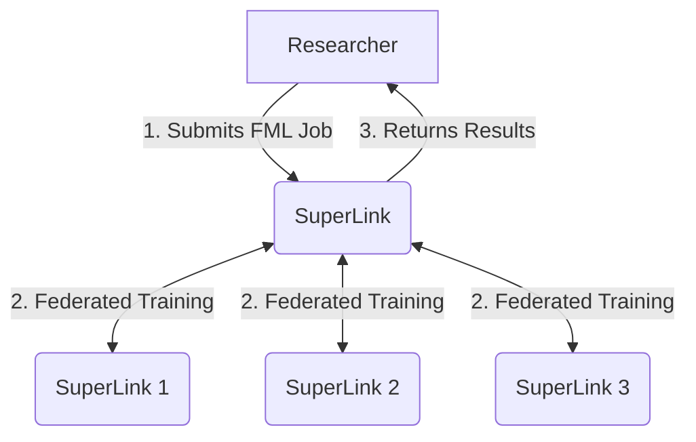

# MELODY : federated Machine Learning fOr dermatologY

MELODY is a project funded under the [DARE UK Real World Exemplar Programme](https://www.ukri.org/opportunity/dare-uk-real-world-research-exemplar-programme/). The aim of the project is to develop and test federated machine learning approaches for dermatology research using clinical images from NHS Tayside and Oxford University Hospitals. By training AI models across multiple TREs without centralising data, the project aims to support the development of more inclusive and representative dermatology AI systems.

# Preamble & Terminology
MELODY uses the [Flower Framework](https://flower.ai/docs/framework/main/en/index.html) to enable federated machine learning (FML). The Flower Framework providers **SuperLinks** and **SuperNodes** to facilitate FML.

A **SuperLink** acts as a central orchestrator and communication hub. It allows for new FML jobs to be sent to superNodes.

A **SuperNode** is a remote client in the FML workflow. a SuperNode receives requests from a SuperLink and sends back the local training and testing results.



# Installation
## Prerequisites
Both the SuperLink and SuperNode require a Linux environment to run with Python3 and pip installed.

It is recommended to use a Python virtual environment when installing the required dependencies.

Both the SuperLink and SuperNode require the same dependencies, they can be installed the Flower package ``flwr``:
```
$ pip install flwr
```
# Deploy

## Deploy a SuperLink
Deploying a SuperLink can be as simple as
```
$ flower-superlink --insecure
```
This will launch a SuperLink and bind it to the default ports ``9091, 9092, 9093``.

While this is sufficient for testing, there are a number of configuration options to improve the auditability of the SuperLink:
```
--database DATABASE  A string representing the path to the database file that will be opened.

--storage-dir STORAGE_DIR The base directory to store the objects for the Flower File System.

--log-file LOG_FILE  Path to the SuperLink log file.
```
<!--May want to talk about certs & auth in the future -->
Using these options will allow for improved audition of the system (See [Auditing](#Auditing)).

The ports that your SuperLink binds to can also be set to suit your needs:
```
--serverappio-api-address SERVERAPPIO_API_ADDRESS This defaults to 0.0.0.0:9091

--fleet-api-address FLEET_API_ADDRESS This default to 0.0.0.0:9092

--control-api-address CONTROL_API_ADDRESS This defaults to 0.0.0.0:9093
```
## Deploy a SuperNode
Deploying a SuperNode is slightly more complicated than deploying a SuperLink.
The simplest deployment of a SuperNode is
```
$ flower-supernode \
--insecure \
--superlink 127.0.0.1:9092 \
--clientappio-api-address 127.0.0.1:9095
```

This deployment would expect an insecure SuperNode to be listening on 127.0.0.1:9092 and is configuring the SuperNode to bind to port 9095.

SuperNodes allow for localised configuration to be set when running a Supernode via the ``--node-config`` command line option. An example can be seen below:
```
--node-config partition-id=1 data-dir=/tmp/mydata/
```
This node config allows for instance specific values to be set that can then be referenced in the source code of the FML Job (See [Using Node Config](#NodeConfig)).


## Deploy Using Docker
<!-- //WIP -->

# Running a Job

## <a name="NodeConfig"></a>Using Node Configurations
## Using App Configurations

# <a name="Auditing"></a>Auditing

# Documentation

<!-- //WIP -->

# Contributing

We welcome contributions. Please see our [contributing guide](CONTRIBUTING.md) to get started.

# Acknowledgements

<!-- // WIP -->
